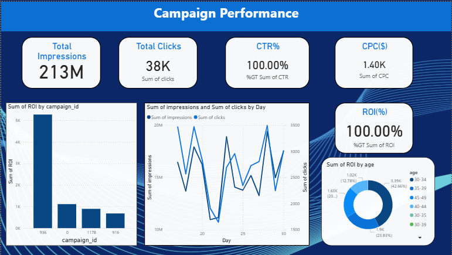
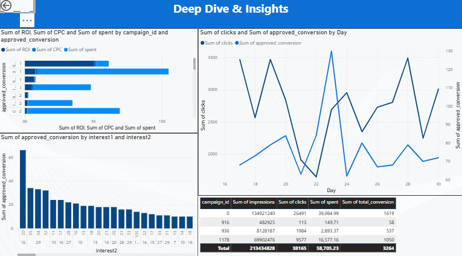
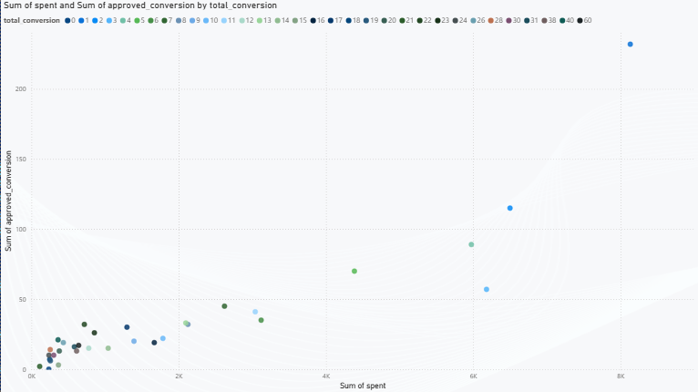

# FUTURE_DS_02# 📊 Marketing Ads Dashboard (Power BI & python)

A 2-page interactive dashboard analyzing Facebook & Instagram ad campaigns.  
This project was developed as part of my **Data Science & Analytics Internship** at **Future Interns**.  

---

## 🔎 Dashboard Pages

### 📌 Page 1 – Campaign Overview
- High-level KPIs: Impressions, Clicks, CTR, CPC, Conversions, ROI
- Trend lines for Spend vs Conversions
- Top Performing Campaigns

---

### 📌 Page 2 – Deep Dive
- Filters by **Age, Gender, Interests, Campaign, Date**
- Breakdown of Spend vs Approved Conversions
- Identify best-performing audience segments

### 📌 Page 3

---

---

## 📈 Metrics Defined

- **CTR (Click-Through Rate)** = `Clicks / Impressions`
- **CPC (Cost Per Click)** = `Spend / Clicks`
- **Conversion Rate** = `Total_Conversion / Clicks`
- **CPA (Cost Per Acquisition)** = `Spend / Approved_Conversion`
- **ROI %** = `(Revenue - Spend) / Spend * 100` (assumed revenue per approved conversion)

---

## ⚙️ How to Run

1. Open `notebooks/01_build_metrics.ipynb` → run all cells → saves `data/processed/campaign_data_with_metrics.csv`  
2. Open `powerbi/Marketing_Campaign_Performance.pbix` → refresh data → link to processed CSV  
3. Explore with slicers: Age, Gender, Interest, Campaign, Date  

---

## 🚀 Insights Example

- 📊 **CTR highest in 25–34 segment** (+32% above avg)  
- 🏋️ **Interest “Fitness” ROI 2.8x** → Suggested more budget allocation  
- ⚠️ Identified **landing page drop-off** for high-CTR but low-conversion ad sets  

---

## 🙋 About Me

👤 **Bharath K S**  
🎓 B.Tech in Artificial Intelligence & Data Science  
💼 **Data Science & Analytics Intern** @ Future Interns  

🔗 [LinkedIn Profile](www.linkedin.com/in/bharath-k-s-179baa2a1)  

---

## 📜 License
This project is shared for **educational purposes**. Data included is **sampled & sanitized**. Please do not upload client-sensitive data.  

